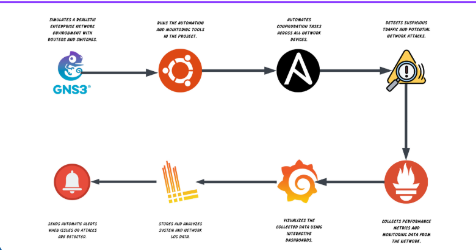
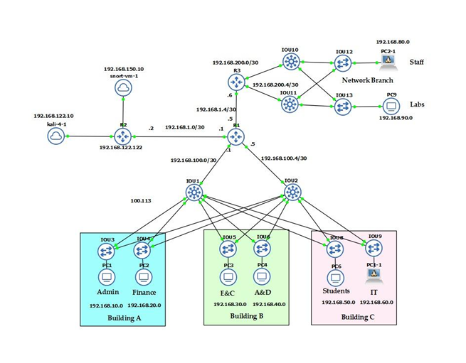
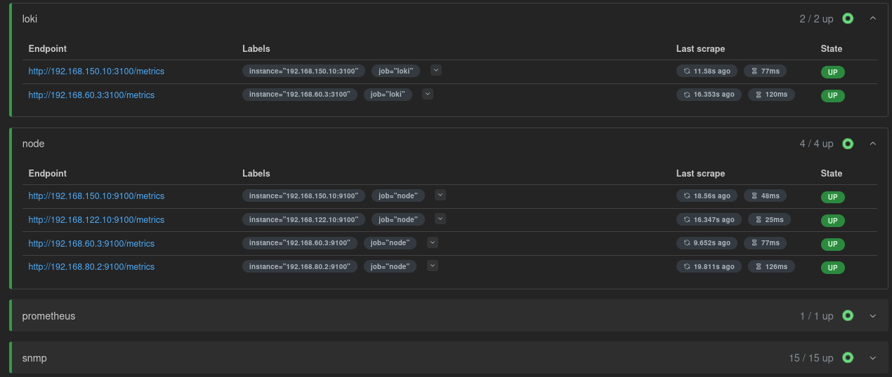
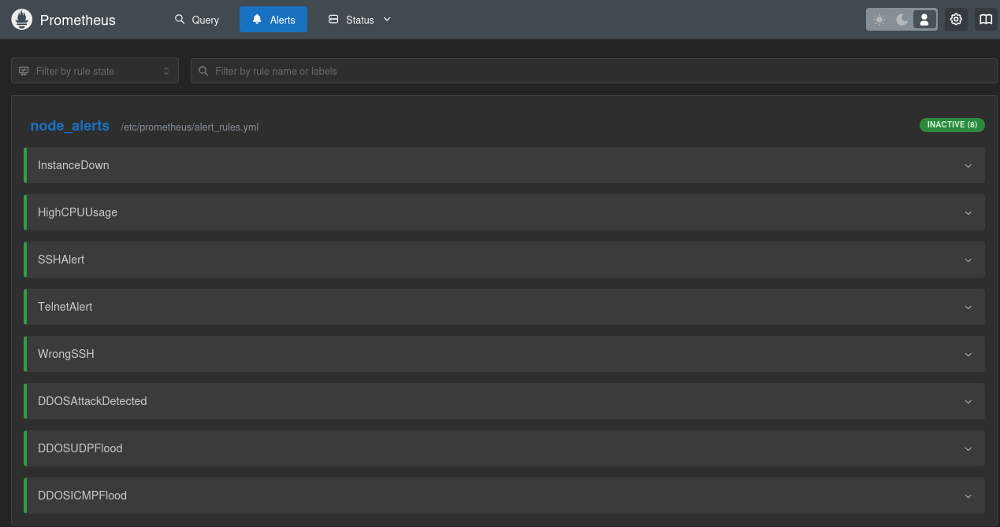
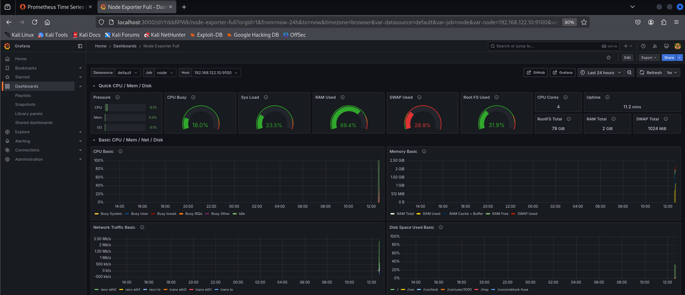
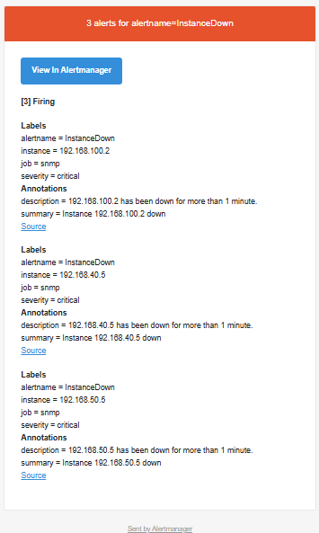

# 🧠 **NETWORK AUTOMATION AND MONITORING USING DEVOPS TOOLS**

## 🔍 Overview
This graduation project focuses on automating network configuration and monitoring using DevOps tools. The goal is to reduce manual configuration errors, enhance network visibility, and improve response time through real-time monitoring and alerting.

## 🎯 Objectives
- Automate the configuration of routers and switches using Ansible  
- Monitor system metrics and network status using Prometheus and Grafana  
- Detect and log network attacks using Snort IDS  
- Manage and visualize alerts using Alertmanager and Loki  

## 🧰 Tools & Technologies
- 🧪 **GNS3** – Network simulation  
- ⚙️ **Ansible** – Automation of configurations  
- 📈 **Prometheus** – Monitoring metrics  
- 📊 **Grafana** – Visualizing data  
- 📄 **Loki & Promtail** – Log collection and aggregation  
- 🚨 **Alertmanager** – Alert management  
- 🛡️ **Snort** – Intrusion Detection System  

## 📸 Sample Results

_Dashboard.png)

## 👥 Team Members
- **Mahmoud Reda Elghreeb Mohamed** – Team Leader & Monitoring Engineer  
- **Mahmoud Shaaban Mohamed** – Network Engineer  
- **Abdelrahman Reda Mostafa** – Security Engineer  

## 🧑‍🏫 Supervisor
Dr. Eman Mahmoud AbdElhalim
Dr. Fatma Alzahra ALagery
Dr. Asmaa Helmy 
---

> 📚 **Graduation Project – Faculty of Engineering, Electronics and Communications Department – Class of 2025**
